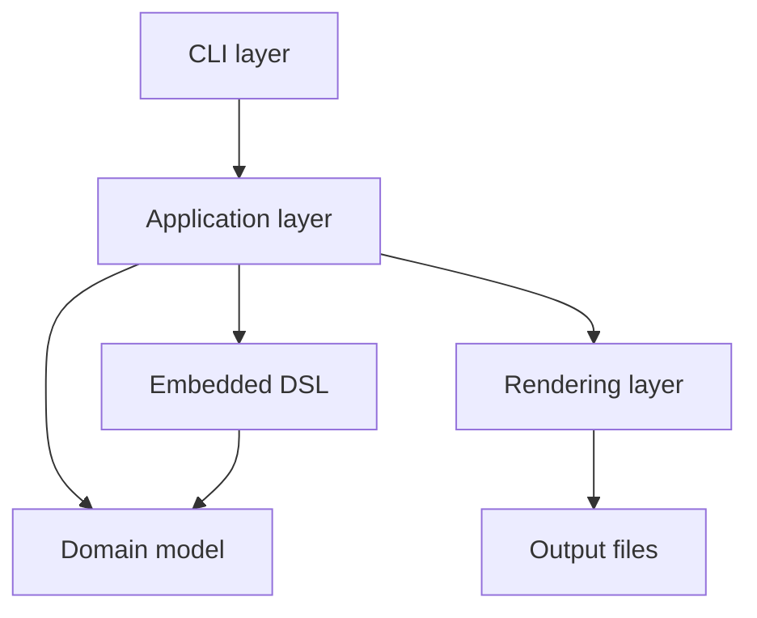

# DeclSlides - Declarative Slides in Scala 3

DeclSlides is a Scala 3 embedded DSL for defining slide presentations in a declarative and compositional way.

A presentation is described as Scala code: slides, layouts, text blocks, bullet lists, code snippets, spacing and images are combined through a small domain-specific language and rendered to different output formats.

The project was developed for the *Paradigmi di Programmazione e Sviluppo* course and focuses on:

* functional domain modelling in Scala 3;
* immutable data structures;
* validation through explicit domain errors;
* an embedded DSL with readable syntax;
* separation between domain, DSL, rendering, application layer and CLI;
* testability of the core logic and command-line interface.

## Features

* Define presentations using a Scala 3 embedded DSL.
* Compose slides from text, bullet lists, code blocks, spacers and images.
* Use predefined themes such as `default`, `light`, `dark` and `conference`.
* Use simple layout hints such as `Flow` and `Centered`.
* Render presentations to:
    * HTML;
    * Markdown;
    * plain text.
* Run presentation scripts from the command line through a dedicated CLI.
* Validate presentations before rendering, reporting domain errors such as empty slides, empty paragraphs, invalid spacers or duplicated slide titles.

## Requirements

For development:

* JDK 17 or later;
* Sbt;
* Scala 3, configured by the project build;
* Scala CLI, for running the CLI locally during development.

For CLI usage:

* A built or downloaded `declslides.jar`;
* Scala CLI installed locally;
* the `DECLSLIDES_SCALA_CLI` environment variable pointing to the Scala CLI executable.

Example:

```bash
export DECLSLIDES_SCALA_CLI=/path/to/scala-cli
```

On Windows PowerShell:

```powershell
$env:DECLSLIDES_SCALA_CLI="C:\path\to\scala-cli.exe"
```

The CLI uses Scala CLI internally to execute `.sc` presentation scripts. This keeps DeclSlides scripts close to normal Scala code, but it also means that Scala CLI must be available at runtime.

## Quick start

Clone the repository:

```bash
git clone https://github.com/AlexTesta00/PPS-24-declarative-slides.git
cd PPS-24-declarative-slides
```

Compile and run the tests:

```bash
sbt compile
sbt test
```

Build the executable jar:

```bash
sbt assembly
```

The assembled CLI jar is generated as:

```text
target/scala-3.8.3/declslides.jar
```

Render one of the example presentations:

```bash

java -jar target/scala-3.8.3/declslides.jar \
  --input examples/HelloPresentation.sc \
  --format html \
  --output dist/hello.html
```

The output file will be written to the path passed through `--output`. Parent directories are created automatically by the generated rendering bootstrap.

## A minimal presentation

A DeclSlides script is a Scala script that evaluates to a validated `Presentation` value.

```scala
import declslides.domain.*
import declslides.domain.Layout.*
import declslides.dsl.DSL.*

presentation("Hello DeclSlides")
  .use(Theme.default) {
    deck(
      slide("Intro", Flow) {
        content(
          text("DeclSlides lets you describe presentations as Scala code."),
          text("The goal is to keep the presentation structure explicit and composable."),
          bullets(
            "Write slides declaratively",
            "Compose content elements",
            "Render to multiple formats"
          )
        )
      },
      slide("Code", Flow) {
        content(
          text("Code blocks can be included directly in a slide."),
          code(
            "scala",
            """println("Hello, DeclSlides!")"""
          )
        )
      }
    )
  }
```

## DSL overview

The DSL is designed around a small number of concepts.

### Presentation

```scala
presentation("Title")
  .use(Theme.default)
  .withFooter("Optional footer") {
    deck(
      // slides
    )
  }
```

A presentation has:

* a title;
* a theme;
* an optional footer;
* one or more slides.

### Slides

```scala
slide("Slide title", Flow) {
  content(
    text("A paragraph"),
    bullets("First point", "Second point")
  )
}
```

Each slide has:

* a title;
* a layout hint;
* one or more content elements.

Available layout hints:

| Layout     | Meaning                                             |
| ---------- | --------------------------------------------------- |
| `Flow`     | Standard top-to-bottom slide content.               |
| `Centered` | Centered content, useful for title or focus slides. |

### Content elements

| DSL function             | Purpose                | Example                                    |
| ------------------------ | ---------------------- | ------------------------------------------ |
| `text(...)`              | Adds a paragraph.      | `text("Introduction")`                     |
| `bullets(...)`           | Adds a bullet list.    | `bullets("A", "B")`                        |
| `code(language, source)` | Adds a code block.     | `code("scala", "println(1)")`              |
| `spacer(lines)`          | Adds vertical spacing. | `spacer(2)`                                |
| `image(source, altText)` | Adds an image.         | `image("img.png", "Architecture diagram")` |

## Themes

DeclSlides provides a small set of built-in themes:

```scala
Theme.default
Theme.light
Theme.dark
Theme.conference
```

A custom theme can also be created directly:

```scala
val customTheme = Theme(
  name = "custom",
  background = "#FFFFFF",
  foreground = "#111111",
  accent = "#0057B8",
  codeBackground = "#F3F4F6"
)
```

## CLI usage

DeclSlides provides a command-line interface for rendering `.sc` presentation scripts.

```bash
java -jar declslides-1.0.1.jar \
  --input <presentation.sc> \
  --format <html|text|txt|markdown|md> \
  --output <output-file>
```

### Required environment variable

Before running the CLI, set `DECLSLIDES_SCALA_CLI` to the path of the Scala CLI executable:

```bash
export DECLSLIDES_SCALA_CLI=/path/to/scala-cli
```

The value must be the executable path, not only the installation directory.

Examples:

```bash
export DECLSLIDES_SCALA_CLI=/usr/local/bin/scala-cli
```

```bash
export DECLSLIDES_SCALA_CLI=$HOME/.local/bin/scala-cli
```

PowerShell:

```powershell
$env:DECLSLIDES_SCALA_CLI="C:\tools\scala-cli\scala-cli.exe"
```

### Options

| Option     | Required | Description                                                               |
| ---------- | -------: | ------------------------------------------------------------------------- |
| `--input`  |      Yes | Path to the `.sc` presentation script.                                    |
| `--format` |      Yes | Output format. Supported values: `html`, `text`, `txt`, `markdown`, `md`. |
| `--output` |      Yes | Destination file for the rendered output.                                 |

The parser is intentionally strict:

* unknown options are rejected;
* missing values are rejected;
* duplicated options are rejected;
* positional arguments are rejected;
* unsupported output formats are rejected.

### Output formats

| Format     | Aliases          | Typical output extension |
| ---------- | ---------------- | ------------------------ |
| HTML       | `html`           | `.html`                  |
| Markdown   | `markdown`, `md` | `.md`                    |
| Plain text | `text`, `txt`    | `.txt`                   |

## Architecture

DeclSlides is organized as a layered application.



## Contributing
Contributions to DeclSlides are welcome! If you have ideas for new features, improvements or bug fixes, feel free to open an issue or submit a pull request.

## Author
- [Alex Testa](https://github.com/AlexTesta00)