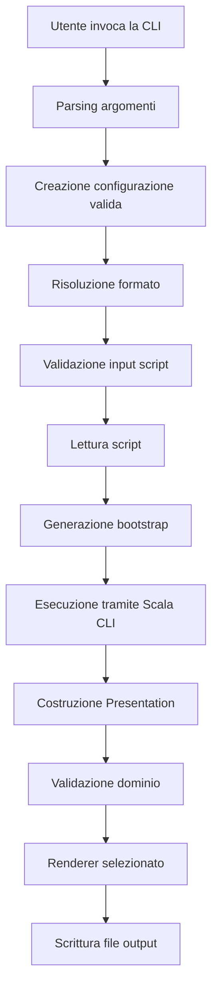
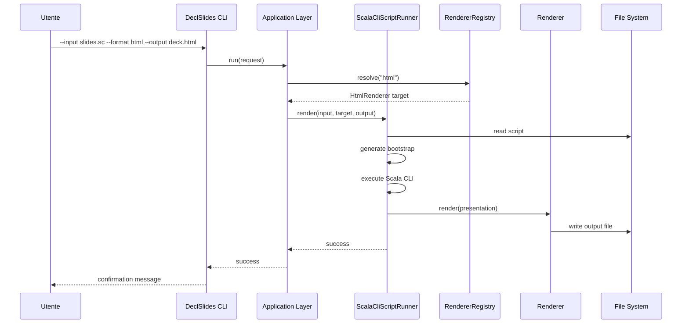
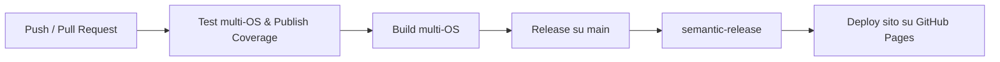

# Design di dettaglio
## Modello di dominio
Il modello di dominio è composto principalmente da `Presentation`, `Slide`, `SlideElement`, `Theme`, `Layout` e `DomainError`. La scelta di tenere Presentation e Slide come modelli validati è stata molto importante: ciò che esce dal dominio non è semplicemente “dato strutturato”, ma un oggetto semanticamente consistente.

Il fatto che `Presentation.apply(...)` e `Slide.apply(...)` restituiscano `Either[Vector[DomainError], ...]` è una scelta significativa: gli errori non vengono lanciati come eccezioni, ma espressi come parte del flusso applicativo. Questo rende il sistema più prevedibile e più adatto a uno stile funzionale.

## Logica applicativa
Il livello applicativo coordina la risoluzione del formato, il caricamento dello script, la generazione del bootstrap e l’esecuzione del processo tramite Scala CLI. Qui si trovano concetti come `RenderCommand`, `ScalaCliScriptRunner`, `InputScriptValidator`, `InputSourceReader` e `BootstrapSourceFactory`.

L’application layer non implementa le regole del dominio e non produce direttamente il rendering: il suo compito è comporre i servizi e orchestrare il flusso.

## Interfaccia Utente
L’interfaccia principale del progetto è una CLI. La sua responsabilità è molto chiara: ricevere argomenti, validare l’invocazione, costruire il comando appropriato, gestire errori user-facing e fornire un feedback finale. In parallelo, il progetto include anche una UI web statica per la presentazione del DSL stesso.

## Persistenza o gestione dello stato
Non essendoci una persistenza classica, il progetto gestisce lo stato in memoria. Tuttavia, esiste una nozione di stato importante nel DSL: `PresentationState` e `SlideState` rappresentano lo stato intermedio della costruzione dichiarativa. Questo stato è immutabile e trasformato funzionalmente.

## Servizi, controller o manager
Nel progetto non compaiono controller in senso MVC tradizionale, ma sono presenti componenti di coordinamento:

- `RenderCommand` funge da coordinatore per il processo di rendering.
- `ScalaCliScriptRunner` è un servizio che incapsula la logica di esecuzione dello script.
- `RendererRegistry` è un servizio che gestisce la registrazione e risoluzione dei renderer disponibili.
- `CliProgram` è un controller che gestisce l’interazione con la CLI e coordina l’invocazione del processo di rendering.

Questi componenti gestiscono flussi, non regole di business.

## Utilità e helper
Sono stati introdotti piccoli componenti riutilizzabili per:

- Messaggi di errore standardizzati (`ErrorMessages`);
- Caricamento di resource testuali (`ResourceLoader`);
- Generazione del boostrap per Scala CLI (`BootstrapSourceFactory`).
- Registry dei render disponibili (`RendererRegistry`).
- Messaggi di successo standardizzati (`SuccessMessages`).

La loro presenza riduce la duplicazione e facilità di refactoring.

## Funzionalità principali
### Funzionalità 1: Definizione dichiarativa di una presentazione

**Descrizione**

L’utente può descrivere una presentazione tramite un DSL in Scala, costruendo il deck attraverso chiamate leggibili e composizionali. Questo è il cuore del progetto, perché separa il contenuto dalla rappresentazione finale.

**Flusso**

1. L’utente scrive uno script .sc utilizzando il DSL.
2. Definisce titolo, tema, footer e slide.
3. Ogni slide è costruita con elementi come testo, immagini, liste, ecc.
4. La descrizione viene passata al dominio, che la valida e costruisce un modello di presentazione disponibile al renderer.

**Componenti coinvolti**

- `DSL`
- `Presentation`
- `Slide`
- `SlideElement`
- `Theme`
- `Layout`
- `DomainError`

**Requisiti soddisfatti**

- RF-01
- RF-02
- RF-03
- RF-04
- RF-05
- RF-06
- RF-07
- RF-08
- RF-09

**Esempio**

```scala
presentation("DeclSlides Demo")
  .use(Theme.conference)
  .withFooter("Alex Testa") {
    deck(
      slide("Intro") {
        content(
          text("DeclSlides turns code into presentations."),
          bullets(
            "Typed DSL",
            "Multiple renderers",
            "CLI execution"
          )
        )
      },
      slide("Code") {
        content(
          code(
            "scala",
            """println("hello declslides")"""
          )
        )
      }
    )
  }
```

### Funzionalità 2: Rendering multi-formato

**Descrizione**

La stessa presentazione può essere esportata in HTML, testo semplice e Markdown. Questo dimostra che il sistema modella il contenuto in modo indipendente dal formato di destinazione.

**Flusso**

1. Il formato richiesto viene risolto dal registry.
2. Il renderer appropriato viene selezionato.
3. La presentazione validata viene convertita in `Document`.
4. Il `Document` viene serializzato nel formato desiderato e scritto su file.

**Componenti coinvolti**

- `RendererRegistry`
- `HtmlRenderer`
- `TextRenderer`
- `MarkdownRenderer`
- `RenderCommand`

**Requisiti soddisfatti**
- 
- RF-10
- RF-11
- RF-12

### Funzionalità 3: Esecuzione CLI

**Descrizione**

Il progetto include una CLI che consente di passare un file `.sc`, scegliere il formato di output e generare il documento finale.

**Flusso**

1. L'utente invoca il jar o il comando CLI.
2. La CLI valida gli argomenti e costruisce un `RenderCommand`.
3. Il `RenderCommand` viene eseguito, orchestrando il processo di rendering.
4. Il runner genera il boostrap ed esegue lo script tramite Scala CLI.
5. Il risultato viene scritto su file e un messaggio di successo viene mostrato.

**Componenti coinvolti**

- `CliProgram`
- `DeclslidesCLI`
- `CliArugumentParser`
- `RenderCommandFactory`
- `ScalaCliScriptRunner`
- `BootstrapSourceFactory`

**Requisiti soddisfatti**

- RF-13

**Esempio**

```bash
java -jar declslides.jar --input slides.sc --format html --output deck.html
```

### Funzionalità 4: Validazione e gestione degli errori

**Descrizione**

Il sistema valida la presentazione durante la costruzione del modello di dominio e gestisce gli errori in modo funzionale, restituendo messaggi chiari all’utente.

**Flusso**

1. Durante la costruzione di `Presentation` e `Slide`, eventuali errori vengono raccolti in un `Vector[DomainError]`.
2. Se la validazione fallisce, il processo si interrompe e i messaggi di errore vengono mostrati all’utente.
3. Se la validazione ha successo, il processo continua normalmente.

**Componenti coinvolti**

- `Presentation`
- `Slide`
- `DomainError`
- `RenderCommand`
- `CliProgram`

**Requisiti soddisfatti**

- RF-14

### Funzionalità 5: Documentazione e sito web

**Descrizione**

Il progetto include un sito statico in inglese che presenta il DSL, mostra esempi di utilizzo, spiega il flusso di compilazione e viene pubblicato automaticamente tramite GitHub Actions.

[Sito di presentazione del DSL](https://alextesta00.github.io/PPS-24-declarative-slides/)

**Componenti coinvolti**

- `/site`
- Workflow di GitHub Actions per la pubblicazione
- GitHub Pages

**Requisiti soddisfatti**

- RF-15

## Flussi principali


Questo è il flusso operativo più importante del progetto. Ogni passaggio ha una responsabilità chiara, e i punti di possibile fallimento vengono gestiti in modo esplicito con errori leggibili.

### Sequence diagram del caso d'uso principale


### Flusso di errore
Un aspetto importante è il flusso di errore. Se la presentazione contiene contenuti invalidi, il sistema non produce un output parziale e opaco, ma restituisce un insieme di errori espliciti. Questo comportamento rende il progetto più affidabile e più utile in un contesto tecnico.

## Scelte progettuali
### Separazione tra dominio e DSL
Il DSL è stato progettato come un livello di authoring, non come il luogo in cui vivono le regole del sistema. La validazione resta nel dominio, perché è il dominio a dover definire cosa sia una presentazione corretta. Questa scelta evita che i vincoli siano sparsi in funzioni di costruzione e rende il modello più robusto.

Il punto di forza risiede nella capacità di costruire un modello di dominio ricco e validato, che poi può essere trasformato in qualsiasi formato desiderato. Il DSL è solo una comoda interfaccia per costruire quel modello, ma non è il cuore del sistema.

### Error handling esplicito
Invece di lanciare eccezioni per i casi normali di invalidità, il progetto usa `Either` e tipi di errore dedicati. Questo vale sia nel dominio sia in varie parti dell’application layer.

Questa scelta migliora testabilità e leggibilità, perché rende espliciti i punti di fallimento e riduce il rischio di comportamento implicito.

### Introdurre un registry dei renderer
Il `RendererRegistry` separa la conoscenza dei renderer disponibili dal loro utilizzo. Questa scelta è piccola ma importante, perché consente di aggiungere nuovi renderer senza cambiare il contratto generale del sistema.

### HTML generato in modo funzionale
Per il renderer HTML si è scelto di usare ScalaTags, evitando un sistema di template esterno. Questo rende il rendering più vicino alla struttura del dominio e mantiene tutto nel linguaggio principale del progetto.

### CLI come layer sottile
La CLI non conosce i dettagli del dominio né del rendering, ma si limita a orchestrare parsing, wiring e messaggi. Questo la rende molto più semplice da testare e modificare.

## Pattern e principi di buona programmazione
### Separazione delle responsabilità (Single Responsibility Principle)
Il progetto è stato costruito applicando con costanza il principio di separazione delle responsabilità. Ogni package ha un ruolo chiaro e ogni componente tende a fare una sola cosa.

Molti dei refactor introdotti nel corso dello sviluppo vanno proprio in questa direzione. Esempi evidenti sono:

- `CliArgumentParser` separato dalla CLI.
- `BootstrapSourceFactory` separato dal runner.
- `InputSourceLoader` e `InputScriptValidator` separati.
- `RenderFormatResolver` separato dal comando di rendering.

### Factory
Le factory compaiono in modo esplicito soprattutto nella creazione dei comandi e nella generazione del bootstrap.

### Strategy
I renderer costituiscono una forma chiara di Strategy: a partire da un `RenderFormat`, il sistema seleziona la strategia di rendering appropriata.

### Builder
Il DSL costruisce progressivamente il modello della presentazione tramite `PresBuild` e `SlideBuild`. Questa struttura ricorda un builder funzionale, basato su trasformazioni di stato immutabile.

### Immutabilità
La presenza di state object immutabili e di modelli dichiarativi immutabili ha ridotto il rischio di bug e ha reso il flusso più prevedibile.

### Open/Closed Principle
L’aggiunta di nuovi elementi come immagini e footer, o di un nuovo renderer Markdown, mostra che il sistema è stato esteso senza modificare in modo distruttivo il nucleo del progetto.

## Gestione dello stato
Il progetto non utilizza un database né una persistenza applicativa nel senso classico, ma gestisce uno stato significativo durante la costruzione della presentazione e nella produzione dell’output.

Il DSL usa due forme di stato intermedio:

- `PresentationState`
- `SlideState`

Entrambi rappresentano lo stato “in costruzione” e vengono trasformati in modo puro, tramite funzioni composite. Questa soluzione è particolarmente adatta a un DSL, perché permette di accumulare configurazioni e contenuti mantenendo un modello semplice.

I dati centrali sono:

- titolo della presentazione;
- tema;
- footer;
- elenco delle slide;
- layout per ogni slide;
- sequenza ordinata di elementi.

La validazione interviene quando lo stato intermedio viene trasformato nel modello finale. Questo è un punto chiave: il DSL non impedisce di descrivere tutto, ma è il dominio a decidere se il risultato è valido.

## Testing e qualità
La strategia di testing del progetto è stata una delle leve principali di qualità. Il test non è stato trattato come verifica finale, ma come strumento di progettazione e chiarificazione del comportamento atteso.

L’adozione del TDD in molte feature ha portato benefici concreti. Prima si è descritto il comportamento desiderato attraverso test leggibili, poi si è introdotto il codice minimo per farli passare, infine si è rifinita la struttura con refactor. Questo ha reso più sicuro introdurre nuove funzionalità come immagini, footer e renderer Markdown.

### Tabella di copertura qualitativa

| **Tipo** | **Area di copertura** | **Strumento** |
| ----| ---- ||
| Unit Test | Dominio | ScalaTest |
| Unit Test | DSL | ScalaTest |
| Unit Test | Render | ScalaTest |
| Unit Test | CLI | ScalaTest |
| Integration Test | Application | ScalaTest |
| Test CI multi-OS | Intero progetto | GithubActions | 

**Qualità del codice**

La qualità del codice viene supportata da:

- Linter
- Formatter
- Conventional Commits
- CI Automatica
- Documentazione tramite Scaladoc

## CI/CD, build e deploy

Il progetto dispone di una pipeline CI/CD basata su GitHub Actions. La pipeline è organizzata in fasi distinte e coerenti:

1. Test su più sistemi operativi e pubblicazione della coverage solo su macchina Linux;
2. Build su più sistemi operativi;
3. Release automatizzata sul branch `main`;
4. Pubblicazione del sito su GithubPages con documentazione annessa.


*rappresentazione della pipeline di integrazione e rilascio continuo del progetto. La struttura mostra come qualità del codice, build, release e pubblicazione del sito siano integrate in un unico flusso automatizzato.*

### Comandi principali
```bash
# Esecuzione test
sbt test

# Esecuzione test con coverage
sbt clean coverage test coverageReport

# Compilazione
sbt clean compile

# Creazione jar CLI
sbt clean assembly

# Generazione documentazione
sbt doc
```

### Uso del jar
```bash
java -jar declslides.jar --input slides.sc --format html --output deck.html
java -jar declslides.jar --input slides.sc --format markdown --output deck.md
java -jar declslides.jar --input slides.sc --format text --output deck.txt
```

### Deploy del sito
Il sito statico del progetto viene costruito come artefatto e poi pubblicato automaticamente tramite GitHub Pages. Questa scelta trasforma la documentazione del progetto in una parte viva del processo di rilascio.

## Documentazione
La documentazione è stata trattata come parte integrante del progetto, e non come attività residuale. Questo si riflette in più livelli:

- documentazione inline del codice tramite Scaladoc;
- README e materiali di utilizzo;
- sito web di presentazione;
- diagrammi architetturali;
- guide operative per build, test ed esecuzione.