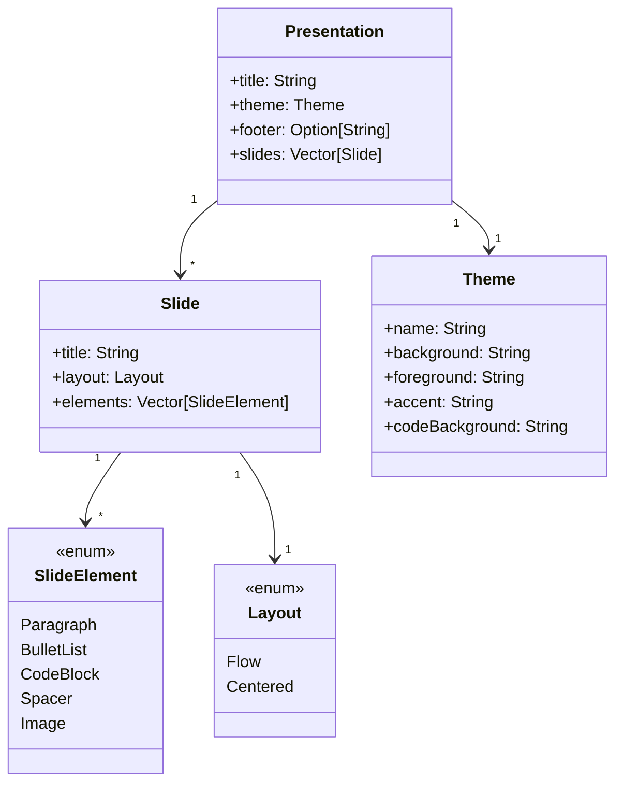

# Dominio
Il dominio applicativo di DeclSlides è quello della definizione e generazione di presentazioni. A differenza degli strumenti di authoring visuale tradizionali, il progetto si colloca nell’intersezione tra presentazioni, automazione e sviluppo software. L’idea di fondo è che una presentazione non sia soltanto un insieme di slide impaginate manualmente, ma possa essere considerata un documento strutturato, descritto formalmente e trasformato in diversi output a partire da una singola sorgente.

In questo contesto, il problema affrontato è duplice. Da un lato, esiste l’esigenza di rappresentare una presentazione in modo ordinato, leggibile e tipizzato. Dall’altro, esiste la necessità di produrre output diversi, ad esempio HTML per la fruizione visuale, testo per debug o ispezione rapida, Markdown per documentazione e condivisione, senza duplicare il contenuto.

Nel dominio di DeclSlides si possono individuare due attori principali, ciascuno con un ruolo distinto all’interno del processo di creazione e fruizione della presentazione.

Il primo attore è **l’autore della presentazione**. Si tratta dello sviluppatore, dello studente o più in generale dell’utente tecnico che realizza la presentazione scrivendo uno script con estensione ```.sc``` e utilizzando le costrizioni offerte dal DSL. L’autore si occupa quindi di definire la struttura del documento, il titolo, il tema, le slide e i contenuti, concentrandosi soprattutto su cosa deve essere rappresentato, piuttosto che sui dettagli specifici del formato finale.

Il secondo attore è il **consumatore dell’output**, ovvero la persona che usufruisce del risultato prodotto dal sistema. Questo ruolo può corrispondere a chi visualizza la presentazione in formato HTML, a chi legge il file Markdown generato oppure a chi consulta l’output in testo semplice per verificare rapidamente la struttura e i contenuti della presentazione.

In un contesto reale, questi due ruoli possono anche essere ricoperti dalla stessa persona. Ad esempio, l’autore può scrivere lo script, generare la presentazione e poi visualizzarla per controllarne il risultato finale. Tuttavia, dal punto di vista progettuale, DeclSlides mantiene una chiara separazione tra il **formato di authoring**, cioè il modo in cui la presentazione viene descritta tramite DSL, e il **formato di consumo**, cioè il modo in cui la presentazione viene resa disponibile all’utente finale.

Questa separazione rende il sistema più flessibile e manutenibile: lo stesso script sorgente può infatti essere trasformato in formati differenti senza modificare la definizione originale della presentazione.

## Entità del dominio

- **Presentation** -> rappresenta l’intera presentazione, con il titolo, il tema, il footer e l’insieme delle slide;
- **Slide** -> rappresenta una singola slide, con un titolo, un layout e un insieme di elementi di contenuto;
- **SlideElement** -> rappresenta un elemento di contenuto all’interno di una slide, che può essere un paragrafo di testo, un elenco puntato, un blocco di codice, uno spazio o un’immagine;
- **Theme** -> rappresenta il tema grafico della presentazione, con colori, font e stili;
- **Layout** -> definisce la disposizione degli elementi all’interno di una slide (Flow, Centered);
- **DomainError** -> rappresenta un errore di validazione del dominio, ad esempio una slide senza titolo o un elemento di contenuto non valido.

## Vincoli di dominio
Le regole principali del dominio riflettono vincoli concreti e comprensibili: il titolo della presentazione non può essere vuoto, una presentazione deve avere almeno una slide, i titoli delle slide devono essere univoci, una slide deve contenere almeno un elemento, testi e blocchi di codice non possono essere vuoti, le immagini devono avere sorgente e testo alternativo significativi, il footer, se presente, non può essere privo di contenuto.

Questa attenzione ai vincoli è centrale, perché sposta il controllo di correttezza dal momento finale del rendering alla costruzione stessa del modello. In altre parole, il sistema non tratta l’errore come un evento eccezionale da nascondere, ma come una parte normale del processo di authoring che va rappresentata in modo esplicito.

## Tabella concettuale del dominio
| Entità           | Ruolo                                                                                     | Responsabilità principale
|------------------|------------------------------------------------------------------------------------------|---------------------------------------------|
| **Presentation** | radice del modello | definisce titolo, tema, footer e insieme di slide
| **Slide**        | unità di contenuto | definisce titolo, layout e contenuti
| **SlideElement** | componente di slide | rappresenta testo, liste, codice, immagini e spaziatori
| **Theme**        | configurazione visuale | definisce palette cromatica e identità visiva
| **Layout**       | disposizione | suggerisce la disposizione dei contenuti
| **DomainError**  | validazione | descrive errori strutturali e semantici del modello

## Diagramma del dominio

*rappresentazione concettuale delle principali entità del dominio e delle loro relazioni. Il diagramma mette in evidenza la centralità del modello ```Presentation```, la composizione delle slide e la natura tipizzata dei contenuti.*