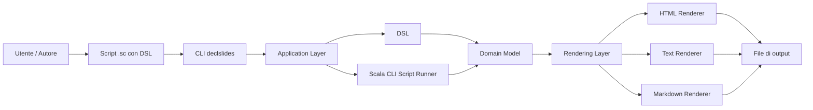
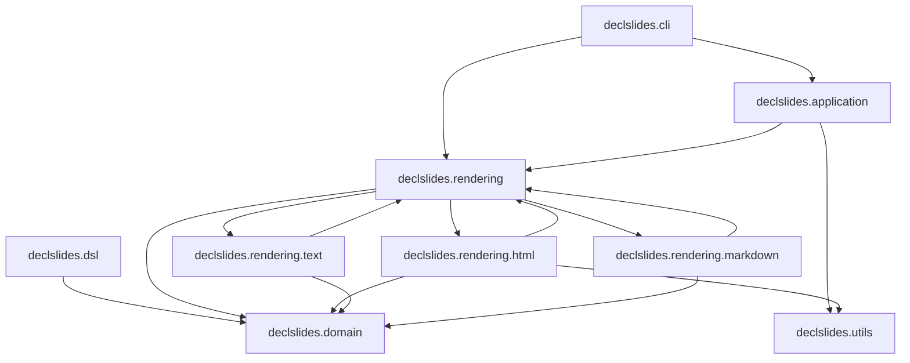

# Architettura Generale
L’architettura di DeclSlides è organizzata in layer distinti, con una separazione chiara fra modello, definizione del contenuto, orchestrazione e rappresentazione finale. Lo stile architetturale adottato può essere descritto come una forma leggera di layered architecture, con forti elementi di separazione del dominio e responsabilità ben delimitate (simile al Domain Driven Design).

Il cuore del sistema è il dominio, che modella il concetto di presentazione e quali regole debba rispettare. Intorno a questo nucleo si collocano il DSL, che fornisce una sintassi espressiva per costruire il modello. 

L’application layer orchestra, validazione, bootstrap ed esecuzione.

I renderer, che traducono il modello in output. 

La CLI, che espone il sistema verso l’esterno.

*Visione d’insieme dell’architettura di DeclSlides. Il diagramma evidenzia la distinzione tra definizione della presentazione, validazione del modello e traduzione in formati diversi.*

Il diagramma mostra il flusso principale: l’utente scrive uno script .sc, la CLI lo inoltra al livello applicativo, il runner lo esegue, il dominio viene validato e infine il modello risultante viene passato al renderer corrispondente per produrre l’output.

## Stile architetturale adottato
La scelta di una layered architecture è stata motivata dall’esigenza di mantenere distinguibili:

- Regole del dominio;
- Sintassi del DSL;
- Logica di orchestrazione;
- Dettagli del rendering;
- Interfaccia utente (CLI).

Questo approccio ha ridotto l’accoppiamento e ha facilitato l’estensione del sistema. La prova più evidente è che nel corso dello sviluppo si sono potuti aggiungere footer, immagini e renderer Markdown senza dover riscrivere il nucleo dell’applicazione.

## Organizzazione del codice
La struttura del progetto è stata organizzata per comunicare chiaramente le responsabilità dei diversi moduli logici.

| **Modulo** | **Responsabilità** |
| --- | |
| `declslides.domain` | Modello di dominio e validazione |
| `declslides.dsl` | Definizione del DSL |
| `declslides.application` | Orchestrazione, validazione e bootstrap |
| `declslides.cli` | Interfaccia a riga di comando |
| `declslides.rendering` | Contratto dei renderer e registry |
| `declslides.rendering.html` | Implementazione del renderer HTML |
| `declslides.rendering.text` | Implementazione del renderer Testuale |
| `declslides.rendering.markdown` | Implementazione del renderer Markdown |
| `declslides.utils`| Funzioni di utilità condivise |
| `src/test` | Suite di test |
| `/site` | Sito di presentazione del progetto |
| `.github/workflows`| Workflow di CI/CD |
| `/readme`| Script per documentazione del README |
| `/examples`| Esempi di script .sc |

Il diagramma seguente mostra le dipendenze fra i moduli principali, evidenziando la separazione fra dominio, definizione del contenuto, orchestrazione e rappresentazione finale.

## Regola di dipendenza tra i layer

La regola principale adottata è che il dominio non deve dipendere da CLI, renderer o application layer. Il dominio descrive cosa sia una presentazione valida; gli altri layer decidono come costruirla, eseguirla o trasformarla in output.

Questa scelta ha guidato l’organizzazione dei package:

- `declslides.domain` non conosce Scala CLI;
- `declslides.dsl` costruisce il dominio, ma non renderizza;
- `declslides.rendering` legge il dominio e produce documenti;
- `declslides.cli` non contiene regole di dominio;
- `declslides.application` collega i pezzi.